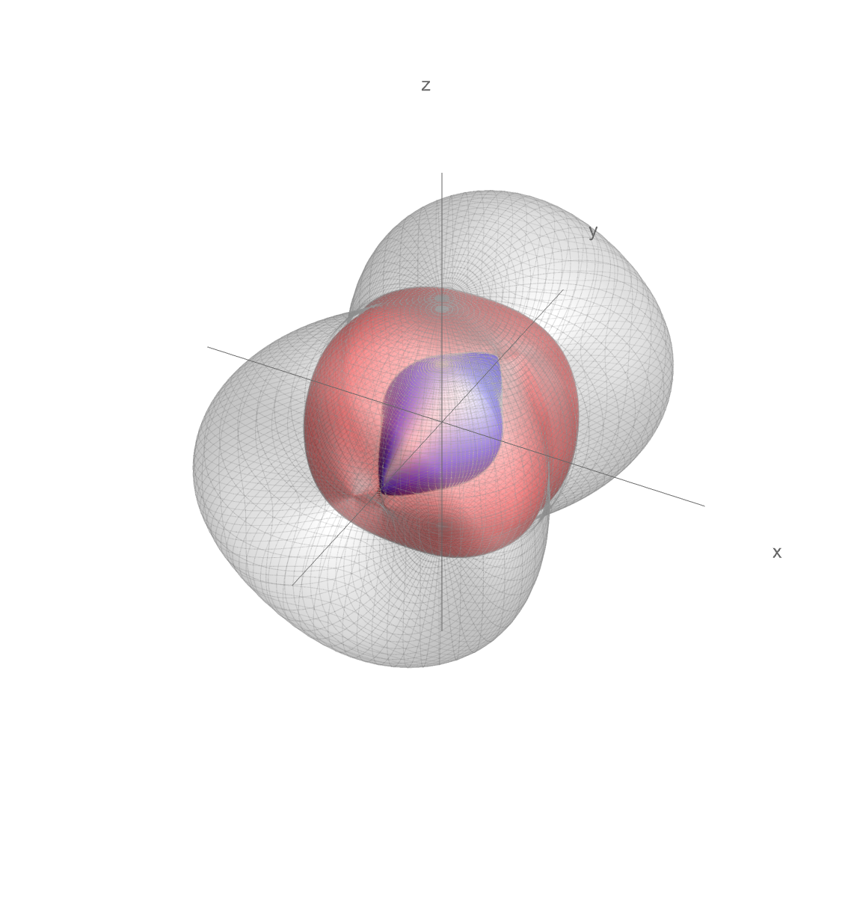
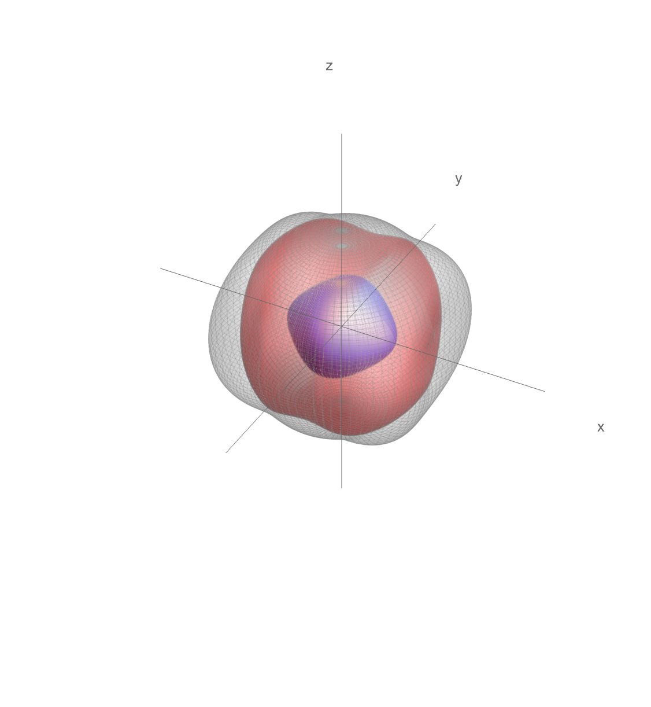

<a href="https://github.com/gpap-gpap/SymbolicAnisotropy">

</a>

# Symbolic Anisotropy

A Wolfram Language package for symbolic calculations in anisotropic elasticity. The package provides tools for the manipulation of elastic tensors of arbitrary symmetry, the calculation of Christoffel tensors, phase velocities, polarization vectors, and reflection and transmission coefficients. The package is designed to be used in the context of seismology, geophysics, and materials science.

## Requirements

_Mathematica >13.1_

## Installation

`<< "https://raw.githubusercontent.com/gpap-gpap/SymbolicAnisotropy/main/SymbolicAnisotropy.wl"`

## Features

- :rocket: Elastic tensors of arbitrary symmetry:
`saCreateElasticityTensor[c  , "Symmetry" -> sym]` where `c` is the tensor label and `sym` is the symmetry of the tensor. The following symmetries are supported:
  - Triclinic:

  ```math

    \begin{bmatrix}
        \text{c}_{11} & \text{c}_{12} & \text{c}_{13} & \text{c}_{14} & \text{c}_{15} &
    \text{c}_{16} \\

    \text{c}_{12} & \text{c}_{22} & \text{c}_{23} & \text{c}_{24} & \text{c}_{52} &
    \text{c}_{62} \\
    \text{c}_{13} & \text{c}_{23} & \text{c}_{33} & \text{c}_{43} & \text{c}_{53} &
    \text{c}_{63} \\
    \text{c}_{14} & \text{c}_{24} & \text{c}_{43} & \text{c}_{44} & \text{c}_{54} &
    \text{c}_{64} \\
    \text{c}_{15} & \text{c}_{52} & \text{c}_{53} & \text{c}_{54} & \text{c}_{55} &
    \text{c}_{65} \\
    \text{c}_{16} & \text{c}_{62} & \text{c}_{63} & \text{c}_{64} & \text{c}_{65} &
    \text{c}_{66}
    \end{bmatrix}
    ```

  - Monoclinic:

  ```math  
    \begin{bmatrix}
    \text{c}_{11} & \text{c}_{12} & \text{c}_{13} & 0 & 0 & \text{c}_{16} \\
    \text{c}_{12} & \text{c}_{22} & \text{c}_{23} & 0 & 0 & \text{c}_{62} \\
    \text{c}_{13} & \text{c}_{23} & \text{c}_{33} & 0 & 0 & \text{c}_{63} \\
    0 & 0 & 0 & \text{c}_{44} & \text{c}_{54} & 0 \\
    0 & 0 & 0 & \text{c}_{54} & \text{c}_{55} & 0 \\
    \text{c}_{16} & \text{c}_{62} & \text{c}_{63} & 0 & 0 & \text{c}_{66} \end{bmatrix}
    ```

  - Orthotropic:

  ```math  
    \begin{bmatrix}
     \text{c}_{11} & \text{c}_{12} & \text{c}_{13} & 0 & 0 & 0 \\
    \text{c}_{12} & \text{c}_{22} & \text{c}_{23} & 0 & 0 & 0 \\
    \text{c}_{13} & \text{c}_{23} & \text{c}_{33} & 0 & 0 & 0 \\
    0 & 0 & 0 & \text{c}_{44} & 0 & 0 \\
    0 & 0 & 0 & 0 & \text{c}_{55} & 0 \\
    0 & 0 & 0 & 0 & 0 & \text{c}_{66} 
    \end{bmatrix}
    ```

  - Transversely isotropic:

    ```math  
    \begin{bmatrix}
    \text{c}_{11} & \text{c}_{12} & \text{c}_{13} & 0 & 0 & 0 \\

    \text{c}_{12} & \text{c}_{11} & \text{c}_{13} & 0 & 0 & 0 \\
    \text{c}_{13} & \text{c}_{13} & \text{c}_{33} & 0 & 0 & 0 \\
    0 & 0 & 0 & \text{c}_{55} & 0 & 0 \\
    0 & 0 & 0 & 0 & \text{c}_{55} & 0 \\
    0 & 0 & 0 & 0 & 0 & \frac{\text{c}_{11}}{2}-\frac{\text{c}_{12}}{2} 
    \end{bmatrix}
    ```

  - Isotropic:

    ```math  
    \begin{bmatrix}
    \text{c}_{11} & \text{c}_{12} & \text{c}_{12} & 0 & 0 & 0 \\
    \text{c}_{12} & \text{c}_{11} & \text{c}_{12} & 0 & 0 & 0 \\
    \text{c}_{12} & \text{c}_{12} & \text{c}_{11} & 0 & 0 & 0 \\
    0 & 0 & 0 & \frac{\text{c}_{11}}{2}-\frac{\text{c}_{12}}{2} & 0 & 0 \\
    0 & 0 & 0 & 0 & \frac{\text{c}_{11}}{2}-\frac{\text{c}_{12}}{2} & 0 \\
    0 & 0 & 0 & 0 & 0 & \frac{\text{c}_{11}}{2}-\frac{\text{c}_{12}}{2} 
    \end{bmatrix}
    ```
  
- :rocket: Rotation and translation transformations for tilt

  ```Mathematica
  Block[{\[Psi], c},
    With[{tensor =
      saCreateElasticityTensor[c, "Symmetry" -> "Orthotropic"],
      transform = saRotationTransformation[\[Psi], {1, 0, 0}]},
    (saContract[transform, tensor] // saConvert[c, #] &) /. saHumanReadable[c]
    ]
  ]
  ```

```math
$$\begin{bmatrix}
  \text{c}_{11} & \text{c}_{12} \cos ^2(\psi )+\text{c}_{13} \sin ^2(\psi ) & \text{c}_{12}
    \sin ^2(\psi )+\text{c}_{13} \cos ^2(\psi ) & \text{c}_{12} \sin (\psi ) \cos (\psi
    )-\text{c}_{13} \sin (\psi ) \cos (\psi ) & 0 & 0 \\
  \text{c}_{12} \cos ^2(\psi )+\text{c}_{13} \sin ^2(\psi ) & \text{c}_{22} \cos ^4(\psi )+2
    \text{c}_{23} \sin ^2(\psi ) \cos ^2(\psi )+\text{c}_{33} \sin ^4(\psi )+4 \text{c}_{44}
    \sin ^2(\psi ) \cos ^2(\psi ) & \text{c}_{22} \sin ^2(\psi ) \cos ^2(\psi )+\text{c}_{23}
    \sin ^4(\psi )+\text{c}_{23} \cos ^4(\psi )+\text{c}_{33} \sin ^2(\psi ) \cos ^2(\psi )-4
    \text{c}_{44} \sin ^2(\psi ) \cos ^2(\psi ) & \text{c}_{22} \sin (\psi ) \cos ^3(\psi
    )-\text{c}_{23} \sin (\psi ) \cos ^3(\psi )+\text{c}_{23} \sin ^3(\psi ) \cos (\psi
    )-\text{c}_{33} \sin ^3(\psi ) \cos (\psi )-2 \text{c}_{44} \sin (\psi ) \cos ^3(\psi )+2
    \text{c}_{44} \sin ^3(\psi ) \cos (\psi ) & 0 & 0 \\
  \text{c}_{12} \sin ^2(\psi )+\text{c}_{13} \cos ^2(\psi ) & \text{c}_{22} \sin ^2(\psi )
    \cos ^2(\psi )+\text{c}_{23} \sin ^4(\psi )+\text{c}_{23} \cos ^4(\psi )+\text{c}_{33}
    \sin ^2(\psi ) \cos ^2(\psi )-4 \text{c}_{44} \sin ^2(\psi ) \cos ^2(\psi ) &
    \text{c}_{22} \sin ^4(\psi )+2 \text{c}_{23} \sin ^2(\psi ) \cos ^2(\psi )+\text{c}_{33}
    \cos ^4(\psi )+4 \text{c}_{44} \sin ^2(\psi ) \cos ^2(\psi ) & \text{c}_{22} \sin ^3(\psi
    ) \cos (\psi )+\text{c}_{23} \sin (\psi ) \cos ^3(\psi )-\text{c}_{23} \sin ^3(\psi ) \cos
    (\psi )-\text{c}_{33} \sin (\psi ) \cos ^3(\psi )+2 \text{c}_{44} \sin (\psi ) \cos
    ^3(\psi )-2 \text{c}_{44} \sin ^3(\psi ) \cos (\psi ) & 0 & 0 \\
  \text{c}_{12} \sin (\psi ) \cos (\psi )-\text{c}_{13} \sin (\psi ) \cos (\psi ) &
    \text{c}_{22} \sin (\psi ) \cos ^3(\psi )-\text{c}_{23} \sin (\psi ) \cos ^3(\psi
    )+\text{c}_{23} \sin ^3(\psi ) \cos (\psi )-\text{c}_{33} \sin ^3(\psi ) \cos (\psi )-2
    \text{c}_{44} \sin (\psi ) \cos ^3(\psi )+2 \text{c}_{44} \sin ^3(\psi ) \cos (\psi ) &
    \text{c}_{22} \sin ^3(\psi ) \cos (\psi )+\text{c}_{23} \sin (\psi ) \cos ^3(\psi
    )-\text{c}_{23} \sin ^3(\psi ) \cos (\psi )-\text{c}_{33} \sin (\psi ) \cos ^3(\psi )+2
    \text{c}_{44} \sin (\psi ) \cos ^3(\psi )-2 \text{c}_{44} \sin ^3(\psi ) \cos (\psi ) &
    \text{c}_{22} \sin ^2(\psi ) \cos ^2(\psi )-2 \text{c}_{23} \sin ^2(\psi ) \cos ^2(\psi
    )+\text{c}_{33} \sin ^2(\psi ) \cos ^2(\psi )+\text{c}_{44} \sin ^4(\psi )+\text{c}_{44}
    \cos ^4(\psi )-2 \text{c}_{44} \sin ^2(\psi ) \cos ^2(\psi ) & 0 & 0 \\
  0 & 0 & 0 & 0 & \text{c}_{55} \cos ^2(\psi )+\text{c}_{66} \sin ^2(\psi ) & \text{c}_{66}
    \sin (\psi ) \cos (\psi )-\text{c}_{55} \sin (\psi ) \cos (\psi ) \\
  0 & 0 & 0 & 0 & \text{c}_{66} \sin (\psi ) \cos (\psi )-\text{c}_{55} \sin (\psi ) \cos
    (\psi ) & \text{c}_{55} \sin ^2(\psi )+\text{c}_{66} \cos ^2(\psi ) \\
  \end{bmatrix}$$
```

- :rocket: Christoffel tensor and calculations
- :rocket: Phase velocities and slowness surfaces :scream: :



- Reflection and transmission coefficients

## Roadmap

- [ ] Group Velocities
- [ ] Ray tracing
- [ ] NMO analysis

## Maintenance and feedback

<giorgos.papageorgiou@ed.ac.uk>

## References

1. Musgrave, M. J. P. (1970). _Crystal acoustics: Introduction to the study of elastic waves and vibrations in crystals_. Holden-Day, San Francisco

2. Nye, J. F. (1985). Physical properties of crystals: their representation by tensors and matrices. Oxford university press.
3. Tsvankin, I. (2012). _Seismic signatures and analysis of reflection data in anisotropic media_. Society of Exploration Geophysicists.
4. _Structural mechanics MIT lecture notes_, <https://web.mit.edu/16.20/homepage/>
5. Helbig, K. (2015). _Foundations of Anisotropy for Exploration Seismics: Section I. Seismic Exploration_. Elsevier.


